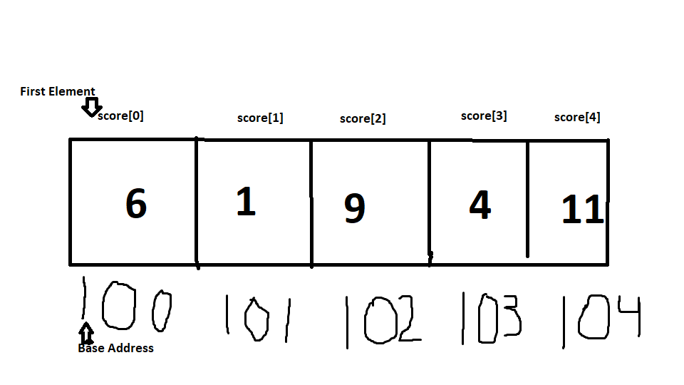

<h1> Array </h1>
<p1> An array is a data structure that contains different elements of the same data type, each stored contiguously in memory. Its syntax is the following "myArray = []"</p1>
<h2> Memory </h2>

<h2>Operations</h2>
<UL>
<LI>Access - Is an O(1) opperation, as every element is one after another in memory. So an elements position can be calculated by a simple equation like: Start + i. This makes it O(1) </p1> 
<LI>Insertion - Is an O(n) operation, as you must go through and shift each element in the array before inserting the new element. If the array is full you must resize the array.</p1> 
<LI>Deletion -Is an O(n) operation. Like insertion the entire array must be gone through element by element.
  </UL>
<h2>Use cases</h2>
<p1> Arrays are very useful for when you know exactly how many elements you need to store. They are quick and easy to implement, and their fast access time makes them a go to when you know exactly how many elements are going to be stored.  Although because they do not have a fast insertion/deletion time, because of this they are sometimes not as good as other structures like a dictionary.  </p1>
<h2>Example</h2>
<p1>
  myArray = []  
  myArray.index() 
  myArray.append() 
  myArray.del() 
  myArray.insert(i, item) 
  </p1>
