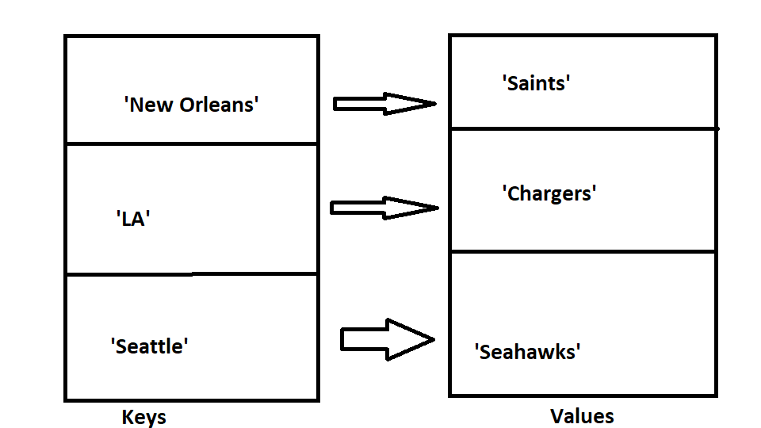

<h1>Dictionary</h1>
<p1> A Dictionary is a mutable(can be changed) containor of keys that are mapped to different values. Meaning it is a key : value data structure. A dictionary is non sequential, meaning it is unordered.</p1>
<h2> Memory</h2>

<h2> Operations </h2>
<UL>
<LI>Get - This is an 0(1) operation. This is constant since it is just returning the value associated with whatever key is given.
<LI> Insertion/delete - These are also 0(1) as we can change values or add values with a quick  assignment operator.   For insertion we are just adding a pair to the containor that is the Dictionary, because they are unordered we do not need to shift like we do with a list.</p1>
<h2> Use cases </h2>
<p1> Dictionaries are very useful as they have a fast look up time. Nearly 0(1). They are not as good as an array for storing consectutive elements that are all the same data type. They are better for showing relationshps between a pair of objects. For example if you were search NFL Teams to see what teams were in certain cities, it may look like the following:
<h2> Example </h2>
<p1> nfl_teams = {'LA' : 'Chargers', 'Seattle' : 'Seahawks', 'New Orleans' : 'Saints'}   #get   nfl_teams.get('LA')   #Insert   nfl_teams['Washington'] = 'Redskins'   #delete   del nfl_teams['Seattle']</p1>
   <p2> print(nfl_team.get('New Orleans'))   output------> 'Saints'</p2>
