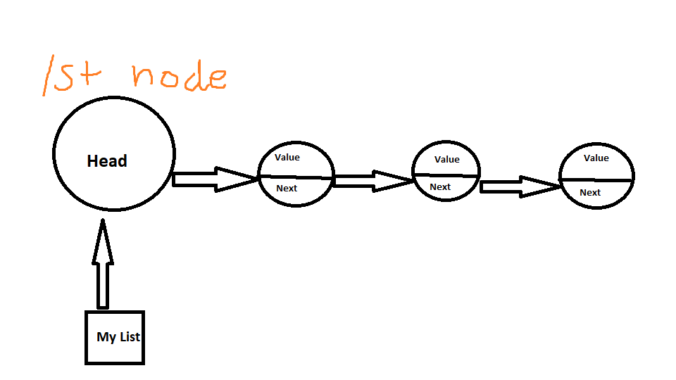

<h1> List</h1>
<p1> A List is a data structure that holds a collection of items. Each of these items holds a position relative to the others. In Python the List acts as a dynamic array. 
  There are also structures called Linked Lists. These come in two different types, singly and doubly linked. Linked Lists contain nodes, these nodes have a value, as well as a pointer. Doubly linked lists point both forwards and backwards, while singly only points forward.  </p1>
<h2> Memory </h2>

<h2>Operations</h2>
<h3> List operations </h3>
<p1> Python list acts exactly like a dynamic array. So go check out that page.  
<h3> Linked List operations </h3>
<UL> 
  <LI>Access and search are both o(n) operations. This is because in order to traverse through the list we must go element by element until we come to the value we are searching for, or accessing. 
  <LI>Insertion and deletion on the other hand are both o(1) operations. As insertion requires making the node previous to the new node point to the inserted node and make the new node point to previouses next. Deletion is much like insertion, the address being pointed to by the deleted node is reassigned to the previous node that originally was pointing to the deleted node. </p1>
<h2>Use cases</h2>
<p1> Linked Lists are very useful data structures and they are very easily changed. Inserting and deleting is a very quick and easy procedure. Although they are not as good as other data structures like Binary Search Trees for searching and accessing elements. </p1>
<h2> Example<h2>
  <p1>
    LinkedList = ll() 
    ll.remove(self,item) 
    ll.insert(self,item) 
    ll.search(self,item) 
  </p1>
    

