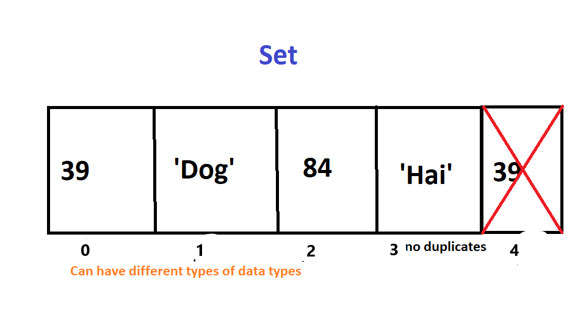

<h1> Set </h1>
<p1>A set is an unordered data structure that is immutable. Sets do not allow duplicates and are heterogeneous. </p1>
<h2> Memory </h2>

<h2>Operations</h2>
<UL>
<LI>  Add - adds items to the set.
<LI> Remove - Removes item from a set.
<LI> in - checks to see if element is in the Set.
  </UL>
<h2>Use Cases </h2>
Sets are good for storing values when you can not have duplicates. Although arrays are better for a bunch of elements when there are duplicates.
<h2>Example</h2>
mySet = {1, 'dog', 60} 
'dog' in mySet 
mySet.add(4) 
mySet.remove('dog') 
