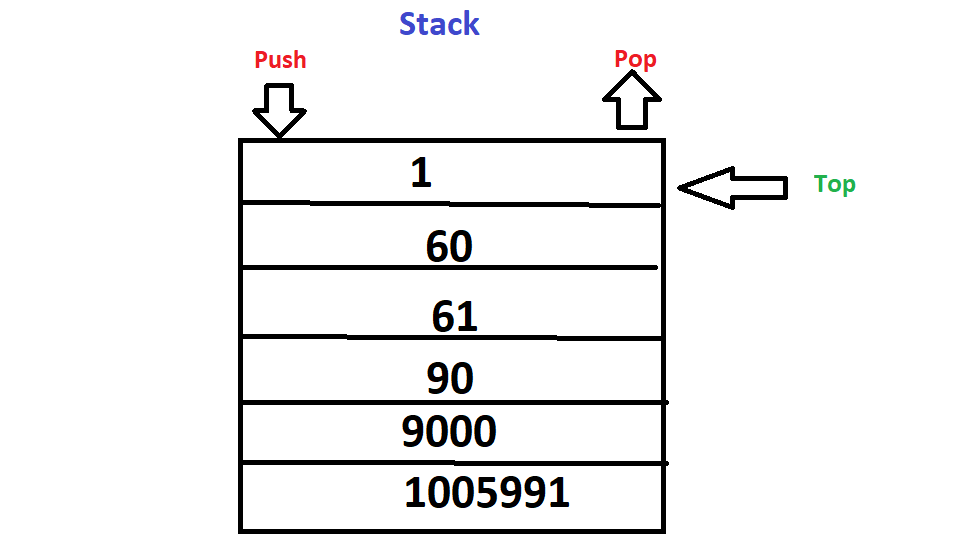

<h1>Stack</h1>
<p1>A Stack is an ordered data structure of elements that are all inserted on top of each other just like a stack of cards. This makes it LIFO(last in, first out).  </p1>
<h2>Memory</h2>

<h2>Operations</h2>

* **push**:
  * this is a O(1) operation.This is because it is a simple operation to just simpily add an element to the top of the stack.

* **pop**: 
  * O(1), constant time. This operation is constant thanks to the stack pointer being based at the top of the stack. The only work the pop operation must do is simply return the value stored at the stack pointer. We don't need to peek inside to return it, which is why it isn't O(n).

* **peek**: 
  * This is a O(n) operation. It simply returns the top item from the stack but does not remove it.
<h2>Use cases</h2>
<p1> Stacks are used to backtrack to see history in programs. A web browser history is a good example of a stack in use. They have super fast pushing and popping times, but are much slower than Binary Search Trees, arrays, and dictionaries at accessing and searching.
<h2>Example</h2>
  <p1>
     stack = Stack()
     stack.push(self, item) #uses append
     stack.pop(self):
     stack.peek(self):

</p1>
