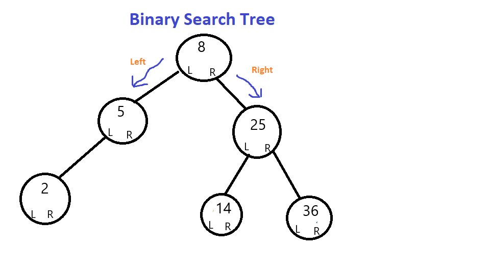

<h1>BST</h1>
<p1> A binary search tree relies on the property that keys that are less than the parent are found in the left subtree, and keys that are greater than the parent are found in the right subtree. Trees have parents, children, and leaves, this goes for other types of trees as well.  </p1>
<h2>Memory</h2>

<h2>Operations</h2>
<UI>
  <LI>Insert, deletion and find are all O(logn) operations.  
    <LI> Insertion is O(logn) as it inserts by comparing values with each node. smaller going to the left, larger going to the right.
      <LI>Find is O(logn) as it uses the same smaller to left, larger to the right formula to check both the left and right for the node we are searching for. If the item is larger than the element to the left we know to check the right, and if its smaller than the value on the right we know to check the left.
      <LI>Traversal is done a few different ways. Post order (checks left, checks right, checks initial node) pre order(checks initial node, checks left, checks right) or in order ( checks left, initial node, and finally the right)  Deletion is quite a bit more complex, the node deleted must be replaced by a node that makes sense and keeps the Binary search trees structure. This replacement node is called a successor, and is chosen further along in the Tree.
<LI>Deleting a node with no children: simply remove the node from the tree.
<LI>Deleting a node with one child: remove the node and replace it with its child.
<LI>Deleting a node with two children: call the node to be deleted. Do not delete that node. Choose either its predecessor node or successor. Copy the user values of new node to the node that is being deleted. If the new node does not have a child simply remove it from its previous parent. If it has a child, replace it with the child at the new nodes parent. 
<h2>Use cases</h2>
  <p1>The most common use is to store data that can be accessed and searched quickly and efficiently. They are often used for implementing maps or sets. They are much faster for seearching than Binary Heaps, while Heaps have a faster insertion time.
<h2>Example</h2>
    <p1>
Binary_Tree = bst  
bst.insert(self, insertee) 
bst.delete(self) 
bst.find(self, item) 

</p1>
