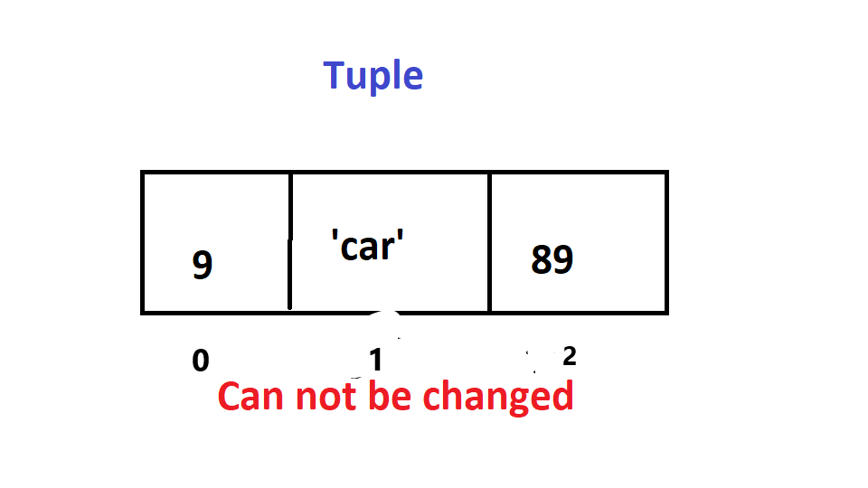

<h1>Tuple</h1>
<p1> Tuples are very similar to arrays, as they are heterogeneous. But unlike arrays, tuples are not immutable (can not be changed). They are bulit into Python, and their syntax is as follows: "myTuple = ()"</p1>
<h2>Memory</h2>

<h2>Operations</h2>
<p1>Access is an o(1) operation, just like an array, it is only one operation as they are all continuous in memory. Tuples do not allow insertion or deletion, as they are immutable.</p1>
<h2>Use cases</h2>
<p1> Why use a tuple instead of a dictionary, or an array? Tuples are better when information is known for whats going into the structure. For example, when you want to store a NFL players team, yards, and age. They can also use other operations that are used by arrays and lists, such as len(length), multiplication(*), and memeber ship(in). But they are not as good as arrays or dictionaries in the sense that you can not change them </p1>
<h2>Example</h2>
phillip_rivers = ('Chargers',4500, 35) 
<p1>
len(phillip_rivers) 
output---->3 
phillip_rivers * 2  
output----> ('Chargers',4500, 35,'Chargers',4500, 35)
</p1>
