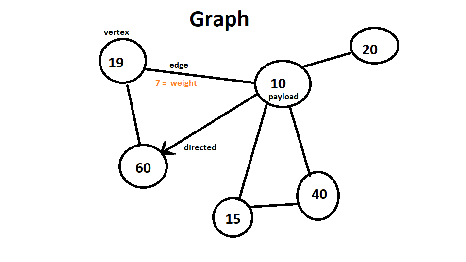

<h1>Graph</h1>
<p1> A graph is a similar data structure to a tree, it has vertices, edges, a weight on the edges, and a path(sequence of vertices). They are implemented in two ways, an adjacency list, and an adjacency matrix  
</p1>
<h2>Memory</h2>

<h2> Use Cases</h2>
<p1> Can be thought of as how the internet is connected. Web pages being the vertices, and hyperlinks being the edges. Or a map, as roads could be edges and cities being vertices. The time it takes to take on road vs another to get city to city could be though of as the weights on those edges. There are algorithms that have been created to find the best sequence (path) between different vertices to find the best one( sort of like how google maps finds the best route between the start and destination). A few of these algorithms are named Breadth First Search(unweighted shortest path), Depth First Search (Computes finish times) and Dijkstras (Weighted shortest path).
<h2>Example </h2>
graph.add_vertex() 
graph.add_edge() 
graph.get_vertex() 
graph.get_vertices()
